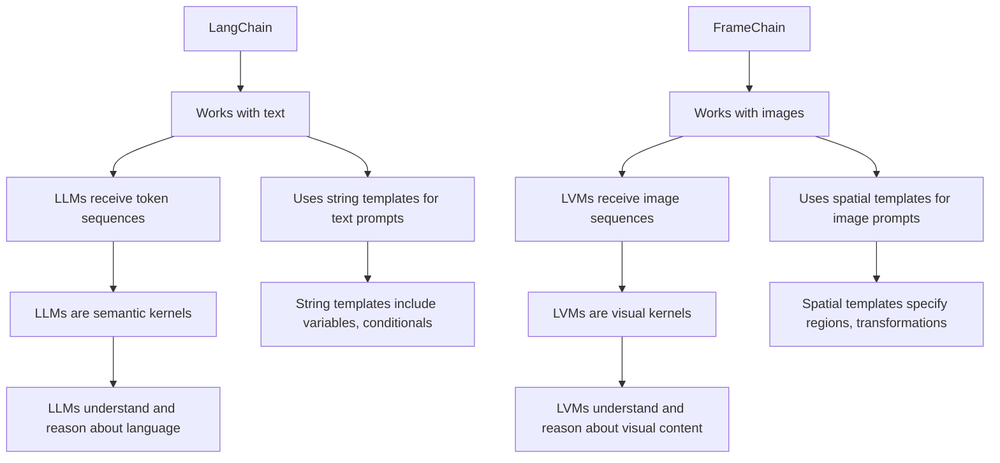

Here's my attempt at completing your thought and fleshing out the FrameChain framework idea:

FrameChain is a Python library that enables composing chains of transformations on images using large vision models (LVMs). It provides a high-level interface for working with LVMs, making it easy to load pre-trained models, apply them to images, and chain together multiple transformations.

Key concepts in FrameChain:

- Frames: Images or sequences of images that serve as the input and output of LVMs. 
- Links: Individual LVMs that perform specific visual transformations on frames.
- Chains: Sequences of links that are applied to frames in order. Chains allow composing complex visual reasoning pipelines.
- Spatial Templates: Declarative specifications of desired image layouts, regions of interest, and transformations to apply. They guide the application of LVMs.

FrameChain vs LangChain:



Getting started:
```
pip install framechain
```

Usage example:
```python
from framechain.chains import Sequential
from framechain.frames import Grid
from framechain.ops import Grayscale, EdgeDetect, Stylize
from framechain.vlms import deLVM

# Load a pre-trained LVM
lvm = deLVM()

# Define a spatial template 

grid_split = Grid(
    rows=2,
    cols=2,
    input="input",
    outputs=[
      ["top-left", "top-right"],
      ["bottom-left", "bottom-right"]
    ]
)
grayscale = Grayscale()
edge_detect = EdgeDetect()
stylize = Stylize('starry_night')
grid_fuse = Grid(
    rows=2,
    cols=2,
    inputs=[
      ["top-left", "top-right"],
      ["bottom-left", "bottom-right"]
    ],
    output="output"
)

# Create a FrameChain
chain = Alternating([Original, Transformed])


# Apply the chain to an image
input = Image.open("input.jpg")
output = chain.run(input)

plt.imshow(output)
```

This example loads a pre-trained Swin Transformer V2 model, defines a spatial template that specifies a 2x2 grid layout with different transformations applied to each region, creates a FrameChain with the model and template, applies it to an input image, and saves the output.

FrameChain aims to make working with LVMs more accessible and enable the creation of powerful visual reasoning systems by providing a compositional framework. It draws inspiration from cutting-edge research on sequential modeling for LVMs.

Let me know if this aligns with your vision for FrameChain! I'd be happy to further refine and expand on the idea.